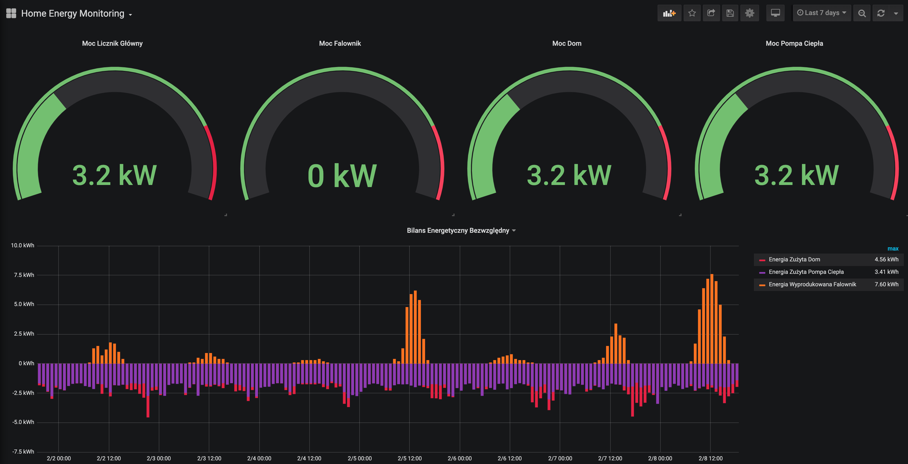
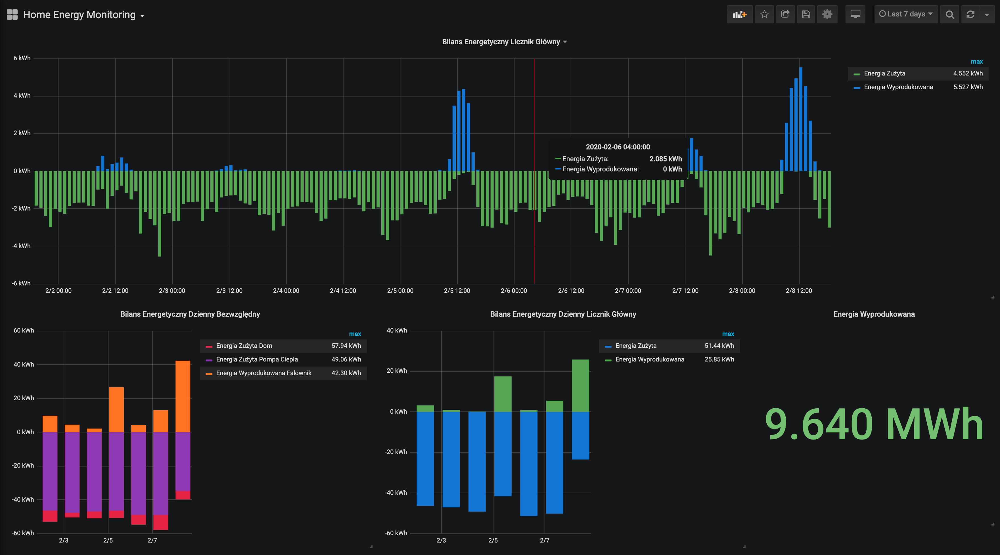

# EnergyMonitoring

Main task of the project is to monitor energy production/consumption in one household. It is written for my personal needs so it's not very well scalable, anyway it works pretty well for 4 months now.

Technologies used in the project:
* python
* mqtt
* influxdb
* sqlite3
* grafana
* modbus-rtu

Project consist of mqtt nodes that communicate with broker. Each script run as service on linux machine. There are meter nodes (main_energy_meter, house_energy_meter, hp_energy_meter, inverter) that collect data from energy meters. They work as services running on raspberry pi with rs-485 hat so they can communicate with energy meters via modbus-rtu protocool. There's also controller node that calls other nodes periodically to do their tasks. Data collected from meters is saved in influx database and then easily displayed as plots in grafana.

Curretly working on more scalable, professional solution, this is only demo for my own needs.
